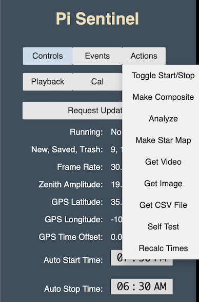
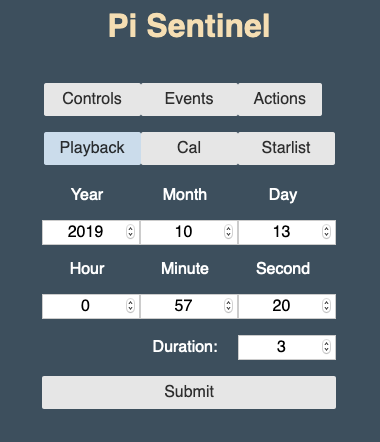
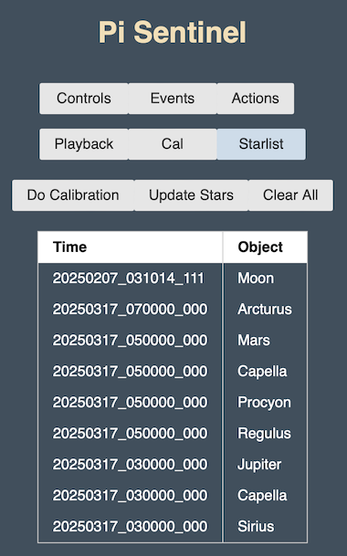

# Pi Sentinel

All-sky camera meteor detection and display software for the Raspberry Pi.

## Software Dependencies

The Pi Sentinel software requires the following external programs and libraries:

```
sudo apt-get install git
sudo apt-get install gpac
sudo apt-get install libatlas-base-dev
sudo apt-get install python3-pip
sudo pip3 install cherrypy
sudo pip3 install pyephem
sudo pip3 install scipy
pip3 install --upgrade numpy
```

The `git` install allows us to access the github repository.

The `gpac` install provides the utility program (MP4Box) used to convert .h264 formatted files to .mp4.

The `libatlas-base-dev` install provides numerical libraries used to for star ephemeris calculations. 

The `python3-pip` install gives us pip3, which is needed for the next install.

The `cherrypy` install provides the Python web server used for the graphical interface.

The `pyephem` install provides routines for calculating star positions used for calibration.

## Hardware 

The Pi Sentinel software is currently being used with the following hardware:

* Raspberry Pi 4 Model B 2GB with 32GB SD card
* USB Camera - SVPRO Mini USB Webcam 1920 1080P IMX322 180 Degree Wide Angle Digital Low Illumination 0.01 lux Industrial USB Camera 
HD 2mp for Automatic Vending Machines
* USB Cable - C2G 38988 USB Active Extension Cable - USB 2.0 A Male to A Female Cable, Center Booster Format, 
Black (25 Feet, 7.62 Meters)
* WAVLINK USB 3.0 to SATA External Hard Drive Docking Station with 2USB 3.0 HUB and TF & SD Card for 2.5 inch/3.5 Inch HDD
* Power Supply - CanaKit USB-C Power Supply
* GPS Module - BN-280 GPS Module NMEA-0183 TTL Level Dual Glonass GPS with 1PPS Flash for Arduino Pixhawk Aircraft Flight Control FPV Freestyle Drone Quadcopter RC Airplanes APM 2.8

The camera has a fisheye lens but the full sky image is somewhat cropped at the top and bottom. 

I wanted to have the camera far away from the Raspberry Pi, but since USB cables are not designed to work over long distances, I am using an Active Extension Cable that has built in circuitry to boost the signal.

I am using a Hard Drive Docking station that lets me attach a 1TB SATA hard drive for archival storage, and also provides a powered USB hub that connects to and provides power to the camera.  I suspect that the Raspberry Pi may not have sufficient power to drive the camera and extension cable directly, so if you do not elect to provide a video archive, I would recommend that you still use a powered USB hub to drive the camera and extension cable.

The GPS module provides serial timing information and a 1 pulse-per-second sync pulse.  These are used to improve the timing accuracy of the measurements.  The GPS module cable wires are connected to the Raspberry Pi GPIO connector as follows:

* GPS Pin 1: 1PPS --- RPi GPIO 4 (GPCLK0) Pin 7
* GPS Pin 2: Gnd  --- RPi Ground Pin 6
* GPS Pin 3: Tx   --- Rpi GPIO 15 (UART RX) Pin 10
* GPS Pin 4: Rx   --- 
* GPS Pin 5: VCC  --- Rpi 3v3 Power Pin 1
* GPS Pin 6: Boot ---

The GPS module also provides a red flashing light coincident with the 1PPS signal that serves as a visual indication that the module is working correctly.  

Note: The GPS Module should be kept several feet away from the hard drive and any other electrical equipment that could interfere with the GPS signals.

## Quick Start

Do this after installing the libraries mentioned above

* Get the Pi Sentinel software

`git clone https://github.com/chavezaurus/pi-sentinel.git`

`cd pi-sentinel`

* Make the C code

`make`

* Start Pi Sentinel and the web server

`python3 sentinel.py`

Now open your web browser and connect to the IP address of your Raspberry Pi using port 9090.  Yours will be different but on my browser the address looks like this:

```192.168.1.20:9090```.

## User Interface

The Pi-Sentinel software provides a web interface which allows the user to control the software and view events with just a web browser.  I am currently using Firefox on a Mac, which is on the same WiFi network as the Raspberry Pi.

The interface consists of an image/video panel on the right and a control panel on the left.  The image panel is where event videos and images are shown.  The control panel lets you control the Pi Sentinel software and examine events produced by Pi Sentinel.  The control panel is made up of five panes that you can view one at a time.  The first pane (Control) lets you control various aspects of the software and view status information.  The second pane (Events) lets you see all the events captured by Pi Sentinel and select each event for examination.  The third pane (Playback) lets you produce an event using the video archive (if present) by specifying a time and duration.  The fourth pane (Cal) lets you view and edit calibration parameters.  The fifth pane (Starlist) lets you collect the position of star images to calibrate the view.

### Control Pane


At the top of the pane are the five selection buttons: **Controls**, **Events**, and **Playback**, along with the **Actions** pop-down menu button.  This set of six buttons exists at the top of all five panes.  In fact, you use the selection buttons to select which pane is shown.

Next is the **Request Update** button.  Pressing this sends a request to the Pi Sentinel software to update the table (below the **Request Update** button) with the current status and commanded state.  This table has the following items:

* **Running** - This indicates whether or not the Pi Sentinel software is processing camera data and looking for changes that might be caused by meteors.
* **New, Saved, Trash** - This provides three numbers that indicate how many events are in the *new* directory, the *saved* directory, and the *trash* directory, respectively.  All new events are automatically placed in the *new* directory and it is up to the user to move them to one of the other directories.
* **Frame Rate** - If Pi Sentinel is processing camera data, this indicates the frame rate (in frames per second) being generated by the camera.  The frame rate can change if the light level changes or if Pi Sentinel controls the rate itself.
* **Zenith Amplitude** - If the Pi Sentinel is processing camera data, this is an estimate of the light brightness at the zenith.  It is produced by sampling a set of pixels near the center of the image.  This estimate is sometimes used by Pi Sentinel to control exposure time.
* **GPS Latitude** - This is the latitude provided by the GPS module, if present.
* **GPS Longitude** - This is the longitude provided by the GPS module, if present.
* **GPS Time Offset** - This is the difference between the time provided by the GPS module and the system time provided by the Raspberry Pi's internal clock.
* **Auto Start Time** - This is the local time at which Pi Sentinel will start processing camera data.  Typically, this is when you might expect to start seeing meteors.
* **Auto Stop Time** - This is the local time at which Pi Sentinel will stop processing camera data.  If both the Start Time and Stop Time are set to the same time, then neither action will occur and you will need to start or stop processing manually.
* **Noise Threshold** - Pixels values that are less than this number above background are ignored.
* **Trigger Threshold** - If the sum of pixel values that are more than the noise threshold above background exceeds this number, then a trigger is initiated and an event is produced.
* **Max Events Per Hour** - The nominal maximum number of events that can be produced per hour.  The way this works can be explained with an example.  Suppose that the Max Events Per Hour is set to 5.  When processing begins, Pi Sentinel has a starting credit of 5 events.  Every time an event occurs, the credit is reduced by 1.  If the credit reaches 0, no more events are allowed.  However, one credit is added every 12 minutes (1/5 hour) up to a maximum of 5 credits.
* **Latency Millisecs** - This specifies the latency (in milliseconds) that is expected due to possible buffering in the camera.  In practice, I have not found a reason to change this from zero.
* **Camera Device** - This specifies which video device is being used by the Raspberry Pi to connect to the camera.  This will typically be `/dev/videoN` where N is some number.  Cameras often connect to several devices if they provide several different data formats.  For Pi Sentinel you need to connect to the device that provides H264 formatted data.
* **Archive Path** - This specifies the path to the directory that will contain the archive, which is all the video that the camera produces while Pi Sentinel is processing data.  If you do not wish to archive all the video, the path should be specified as: `none`.

Next is the **Submit** button.  If you change one of the parameters above, you must click this button to have these changes submitted to Pi Sentinel.

If you press the **Actions** button, you will see drop-down commands, some of which are shown below:



If Pi Sentinel is not processing, then pressing the **Toggle Start/Stop** selection will start processing.  Alternatively, if Pi Sentinel is processing, then pressing this command will stop processing.

Pressing the **Force Trigger** command will cause an event to be immediately generated.  This command is available only when Pi Sentinel is processing data from the camera.

Pressing the **Make Composite** command will cause a composite image to be produced from the most recently selected event video.  Because making a composite image uses the same hardware decoder used by Pi Sentinel for normal camera processing, this command is available only when Pi Sentinel is not currently processing data from the camera.  

Pressing the **Analyze** command will instruct the software to produce a CSV file (comma separated variable) that contains a time history of the event, including the time of each video frame, the number of pixels that are above the noise threshold, the sum of the pixel values above the noise threshold, the X and Y coordinates of the centroid of the pixels above the noise threshold, and the calculated azimuth and elevation of this centroid.  Azimuth and elevation calculations depend on accurate calibration parameters so make sure a full calibration is done beforehand.  Like the previous command, this command is available only when Pi Sentinel is not currently processing data from the camera.

Ideally, you should see pixel values above the noise threshold only when a meteor is present.  However, if examining the CVS file shows pixel values above the noise threshold at other times, you should consider raising the **Noise Threshold** value in the **Controls** pane and remaking the CVS file.  

Very often the main source of noise will be the moon because of how bright it is.  To remedy this, you can do the following:  After selecting an event and making a composite, move to either the **Cal** pane or the **Starlist** pane to show the locations of celestial objects, including the moon, that are in the field of view at the time of the event.  Now the Pi Sentinel program knows where the moon is and it will ignore pixels near the moon when producing the CSV file.

Pressing the **Make Star Map** command will instruct the software to produce an image, from the most recently selected event video, that attempts to enhance the background in order to make faint stars visible.  It works by summing all frames from the first half of the video, subtracting an equal number of frames from the second half of the video, and then producing a suitably scaled image from the result.  In theary, all static features and noise accumulated during the first half are cancelled out by subtracting the frames from the second half.  However, if the video is long enough, the stars accumulated during the first half will have moved sufficiently, and so will not be cancelled out when the frames from the second half are subtracted.

In order to make a video long enough for this process to work, it is necessary to produce a Playback video from the video archive, as described in the **Playback** discussion below.  I have found that a playback with a 300 second duration appears to work reasonably well and will produce an image that clearly shows several bright stars and planets.  By making several such star map images at various times throughout a clear night, it is possible to collect enough calibration reference measurements to permit a full calibration using optimization techniques.  This process is described in the **Starlist** section below.

However, producing a long duration playback is tedious and requires a large amount of memory.  To help with this a script can be used to automate the process.  The Python script `starmap.py` is an example script designed to produce a set of star maps from archive data collected over a single night.  To use it, edit the `start`, `end` and `delta` assignment statements to select the start time, the end time, and the time interval.  At each of the selected times, the script produces a playback video, uses the running Pi Sentinel web program to produce a star map, and then replaces the long duration playback video with a short duration playback video that uses much less memory.

The **Get Video** command is used to fetch the most recently viewed video to local storage.  On my Mac I use this to bring the video file from the Raspberry Pi to the Mac.

The **Get Image** command is used to fetch the most recently viewed composite image to local storage.  Of course, this works only if a composite image has already been produced by the **Make Composite** selection or the **Make Star Map** as described above.

The **Get CSV File** command is used to fetch the CSV file of the most recently viewed event to local storage.  Of course, this works only if a CSV file has already been produced by the **Analyze** command.

The **Self Test** command initiates a sequence of actions designed to fully test the Pi Sentinel system.  At the beginning of this sequence, processing of camera data is started, then after a period of time, a Force Trigger is initiated, and then, after a period of time, processing of camera data is stopped.  This sequence lasts for about three minutes and is repeated 10 times.  This command is not available if Pi Sentinel is already processing camera data.

### Events Pane

Press the **Events** button to select the **Events Pane** as shown below.


The **Events Pane** contains three selection buttons (**New, Saved, Trash**), used to select one of three directories (`new`, `saved`, `trash`) containing event files.  When events occur, they are automatically placed in the `new` directory.  The left column shows a list of video file names associated with each event. The file name reflects the UTC time that the event occurred.  To play the video of the event, just click on the file name.  If a composite image has already been produced using the **Make Composite** command, you can see the composite image by clicking the file name again.  If you continue clicking the file name, you will toggle between seeing the composite image and the video player.

The second column in the table lets you specify into which directory you would like to move the associated event. At first, all the rows indicate `new`, which means the event stays in the `new` directory.  If you click the `new` cell, it will change to `trash` indicating that the associated event will be moved to the `trash` directory.  If you click the cell again, it will change to `saved` which means the event will be moved to the `saved` directory.  Clicking the cell again changes it back to `new`, which is where you started.  This lets you quickly scan through all new events and decide where each event belongs.  The actual movement occurs when any one of the selection buttons (**New, Saved, Trash**) is pressed.

Similarly, if you select the **Saved** button, you will see a table containing all the events that are in the `saved` directory.  These events can be examined and moved just like events in the `new` directory.  You can also examine and move events in the `trash` directory by selecting the **Trash** button.

### Playback Pane

Press the **Playback** button to select the **Playback Pane** as shown below.



If you decide to maintain a video archive, the Playback capability lets you go into the archive and generate event files at any time and with any duration, as if a genuine event occurred at that time.  This can be useful if you know from other sources that a meteor event occurred at a specific time but Pi Sentinel did not trigger for whatever reason.  Or, perhaps Pi Sentinel did produce an event, but the event video started too late or cut off too soon. In this case, the Playback capability will let you produce a new event with expanded time coverage.

The **Playback** pane lets you specify a start time and a duration in seconds.  For convenience, the start time is initialized to the time of the last event selected.  If the video archive contains video that matches the specified start time and duration, then Pi Sentinel creates a new event and places it in the `new` directory where it can be examined and moved just like any other event.  To distinquish *normal* events from *playback* events, the *playback* event names are shorter since they do not specify time to millisecond resolution. 

### Cal Pane

Press the **Cal** button to select the **Cal Pane** as shown below.


The **Cal** pane presents all the parameters needed to calibrate the view, that is, to map each point in the image view to a true Azimuth and Elevation, taking into account the positioning of the camera and the distortion of the lens.  To assist in this effort, the calculated positions of the four cardinal directions (N,S,E,W) and the position of the zenith (Z) are indicated in the view area by solid red dots.  Also, the calculated positions of the brightest stars at the time of the last selected event, are indicated in the view by red circles.  The parameters can be edited by hand and then the star positions can be updated by pressing the `Update Stars` button.

The user should enter the Latitude, Longitude, and Altitude of the camera and adjust a few of the parameters by hand to get a rough calibration.  A final calibration will depend on locating and identifying stars at known times as described later.  The parameters that might be adjusted initially by hand include:

- **COPx** and **COPy** These are the pixel coordinates of the Center of projection of the camera image.  
- **a0** This indicates the rotation of the camera.
- **V** This indicates magnification of the image.  It is the first-order angular size of each pixel, near the center of the image, in radians per pixel.  

Edited calibration parameters can be saved by pressing the `Save Calibration` button.

## Starlist Pane

Press the **Starlist** button to select the **Starlist Pane** as shown below.



The **Starlist** pane presents a list of selected star measurements used to perform a calibration. The view shows the image of the most recently selected event, along with markers showing the calculated position of the brightest stars and planets visible at the time of the event.  The event should be one created with the **Make Star Map** command as described earlier.  The calibration parameters may need to be adjusted by hand such that the apparent star position is reasonably close to the calculated star position.  To add a measurement to the list, click on the apparent star position.  The program calculates the centroid of the apparent star position and finds the nearest star.  It then presents a dialog allowing you to approve the star selection whereupon it adds the measurement to the list.  You can add measurements from several events by going back to the **Events** pane, selecting a different event video, and then returning to the **Starlist** pane.  

After enough measurements have been selected, press the `Do Calibration` button.  This sends the measurement data to the Pi Sentinel software, which performs an optimization to find the set of calibration parameters that best fits the measurements.  This set is returned and replaces the calibration parameters displayed in the **Cal** pane.

To see how well the calibration worked, go to the **Events** pane, select one of the events created with the **Make Star Map** command, and return to the **Starlist** or **Cal** pane.  Each apparent star image should be within the circle of its calculated star position.

## Mask File

The mask file is used to specify areas of the image that should be ignored.  The mask file contains an image of the camera field of view in which the areas to be ignored are painted red.  The image should be scaled to 640 pixels wide and 360 pixels high and be saved as `mask.ppm` (PPM format) in the same directory as `sentinel.py`.  

To produce this file, I started with an event video (either naturally occurring or forced) and created a composite JPEG image file.  I then opened the JPEG file with Gimp, scaled it to 640 x 360 pixels, selected the Pencil tool, widened the tool to a convenient size, selected solid red as the foreground color, and then painted the areas of the image red that were not open sky.  I then did an Export As... and saved the result as `mask.ppm`.  Gimp can be run on the Raspberry Pi or on any other computer.

The mask file is read by the sentinel program every time it starts.

## Things Left To Do

* Add Empty Trash command

## Contact

J C Chavez chavezaurus@gmail.com

